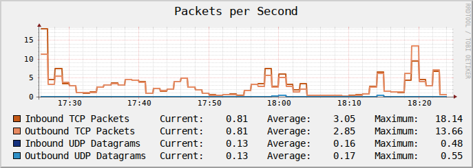
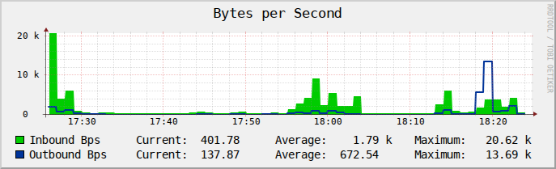
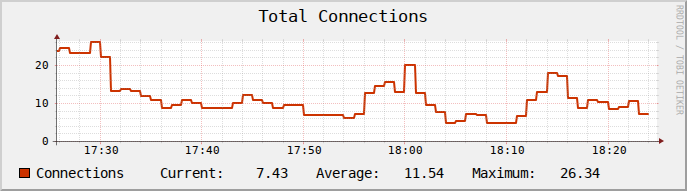
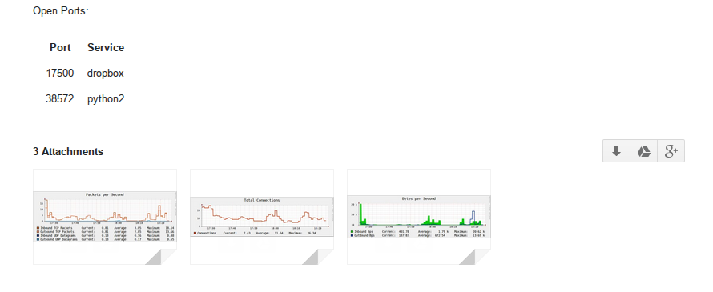

RRD Report
==========

Python script for Windows and Linux that tracks statistics for in/out 
connections, bps, and packets per second. It the generates RRD graphs and fires off 
an email report which also includes open ports.

Requirements
------------
+ Python 2.4-2.7 for the linux version and Python 3 for Windows
+ [RRDTool](http://oss.oeticker.ch/rrdtool/)

Usage
-----

First make sure rrdtool is installed. For windows it should be installed in the same 
directory. Then modify the config file "stats.conf" to include your email information, 
whether or not you need to be authorized to send to the mail server and whether or not 
to us TLS. 

You then set frequency to the max time you will be tracking this data (an hour, a day or a week). 
Cycles will be the exact length of time you want to script to run, cycles will be expressed in units with each unit's 
size dependent on what you see 'frequency' to:

+ hour - 1 minute
+ day - 1 hour
+ week 1 day

So for example if you set 'frequency' to day and 'cycles' to 4, this will be 4 hours. Likewise setting
'frequency' to week and 'cycles' to 4 will be 4 days.

A set of three graphs such as the ones below will be generated:

These will be delivered as an email with a list of open ports included:

